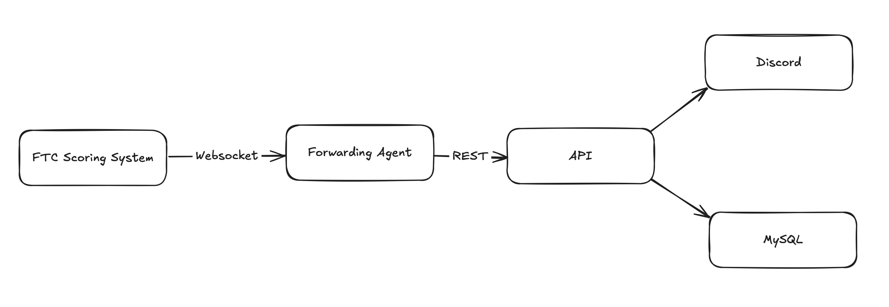

# FTC Queue Helper

An integrated platform to notify teams to go to queueing!

## System Design

- FTC Scoring System
  - Pre-provided software from FIRST. Has an internal API to communicate event state
- Forwarding Agent
  - Host with both Scoring System and Internet Access
- API
  - Publicly hosted API.
  - Ingests events from scoring system and creates Discord notifications
  - Handles Discord commands for role selection
- Discord
  - Read-only server for students to receive notifications
    - #notifications
    - #team-roles with instructions on how to use the bot
      - Bot (see API) can be sent commands via direct-message to select team roles

## Contributing Guidelines
- Please feel free to ask quesitons about anything in this codebase or create Pull Requests!
- Before submitting, please use `mypy` and `black` to ensure Python code quality.
